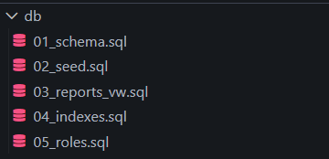
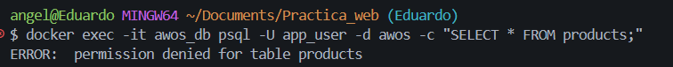
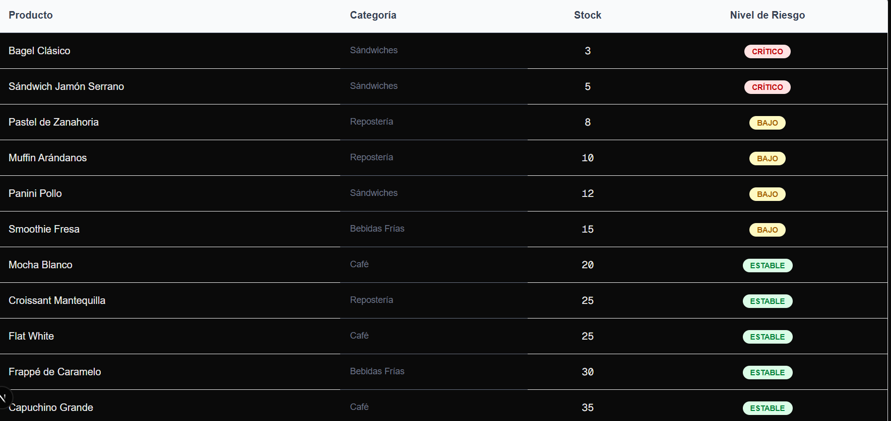

# Cafeteria
Este proyecto es una plataforma de analítica de datos diseñada para una cafetería, construida con Next.js 15, PostgreSQL 16 y Docker. El sistema implementa una arquitectura segura basada en roles y optimización mediante índices y vistas.

## Instrucciones de Ejecución
Para levantar todo el Proyecto , asegúrese de tener Docker instalado y ejecute:
docker compose up --build

# Arquitectura de Base de Datos

La base de datos se inicializa automáticamente mediante scripts ordenados en la carpeta /db

### Seguridad y Roles
Se ha configurado un usuario de aplicación que solo tiene permisos de lectura sobre las vistas.

### Views
El frontend consume exclusivamente las siguientes vistas, para cumplir con el requisito de no exponer tablas directamente:
1. vw_sales_daily

2. vw_top_products_ranked

3. vw_inventory_risk

4. vw_customer_value

5. vw_payment_mix

# Funciones del Frontend
La aplicación utiliza Server Components para la recuperación de datos.

-El reporte de productos permite búsqueda por nombre
-Los reportes de gran volumen (Productos y Clientes) utilizan LIMIT y OFFSET gestionados desde la URL para que asi no se sobrecargue la memoria del navegador.
-Se utilizan colores en el reporte de inventario para identificar mejor el estado de los productos

# Estructura del Proyecto
1. /web: Aplicación Next.js.

2. /db: Scripts SQL de inicialización.

3. Dockerfile: Configuración del entorno Node.js para producción.
